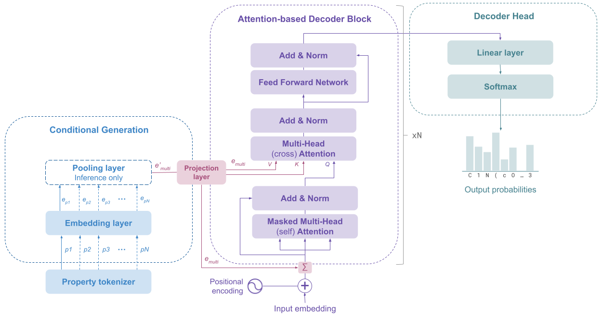

# Conditional Multi-Property Optimization for Generative Pre-trained Transformer

This repository contains the code for the paper "CoMPO-GPT: Cross-Attention Conditioning for Multi-target Molecular Design in Generative Models".

<figure>
    
</figure>

## Setup

This code was written and tested on a NVIDIA GeForce RTX 4090 GPU. You must have `conda` installed to follow the instructions below.

First, use git to clone the repository. Our setup comprises of two environments for (1) running the generative model and (2) running the molecular activity prediction models.

**1. Create `aidd` conda environment**

```bash
$ git clone https://github.com/arthurcerveira/CoMPO-GPT
$ cd CoMPO-GPT
$ conda env create -f environment.yml
```

**2. Create `chemprop` conda environment**

```bash
$ cd chemprop
$ conda env create -f environment.yml
$ conda activate chemprop
$ pip install -e .
```

## Instructions

#### With `conda activate aidd`

1. Generate datasets by running `scripts/01-ExCAPE-EDA.ipynb` (optional, as the data is already provided in the `data` folder). Running this notebook requires the full ExCAPE dataset available [here](https://solr.ideaconsult.net/search/excape/).
2. Pre-train and fine-tune the model: 

```bash
$ bash scripts/02-fine-tuning.sh
```

3. Generate molecules (with model trained for 25 epochs): 

```bash
$ bash scripts/03-single-target-generation.sh 25
$ python scripts/04-multi_target_generation.py 25
```

#### With `conda activate chemprop`

1. Train chemprop models: 

```bash
$ python scripts/05-train_chemprop_pXC50.py
```

2. Predict molecular activity with chemprop models:

```bash
$ python scripts/06-predict_activity_chemprop.py 25
$ python scripts/07-predict_activity_multitarget.py 25
```
## Data visualization

To visualize the results, you can run the following notebooks:

- `scripts/08-Data-Viz.ipynb` (with `aidd` environment)
- `scripts/09-QSAR-Data-Viz.ipynb` (with `chemprop` environment)